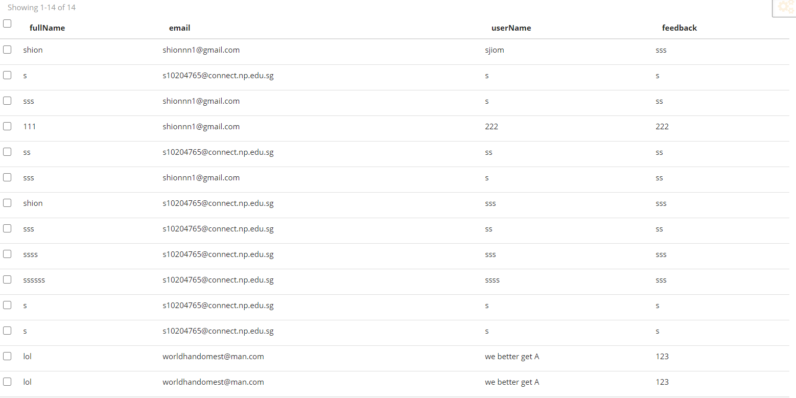

# AITA
AITA stands for "An Introduction to APIs". This website aims to give a basic understand how an API work and letting users try out various APIs on the site as well.
 
## Design Process
As an informative website giving informative about APIs on an introductory level, as such, animations will be an essential part of the design implementation for users understand the content visually. AITA also provides ready to use APIs for users to have a more experential learning.

**Example Scenario (May not be the most accurate)**
> 1. Students like Lester or Keng Shion, as IT students coming across a new topic like API. 
> 2. Feeling blur like sotong after lesson and even googling does not help.
> 3. Stumbled across this website after seeing the beautiful landing page filled with animations, the students suddenly got a better understanding.
> 4. Finally after playing the games these students have finally grasp the basic concept of API!

View the wireframe:
https://xd.adobe.com/view/01023a2c-5511-4685-937a-656d35b09470-5451/

## Features
### [Homepage - index.html](https://s10208233.github.io/ID_Assg3_website/index.html)
The homepage displays an banner of 'AITA' followed by a simple infographic style explaination of how API requests works layed out from top to bottom.

### [Play - Games.html](https://s10208233.github.io/ID_Assg3_website/play.html)
The Play page in AITA allows users to test or play with working public APIs made into mini-games. Various minigames are stated below.

#### Blackjack API
Features a playable Blackjack game for players/users to play against an opponent which makes moves based on the random function in javascript.

#### NASA API
Retrieves daily posts from the official NASA website and has pictures from various rovers on the planet Mars.

#### Trivia API
A game quiz on general knowledge, mostly based in American context.

#### Dogs API
Fetches images of dogs.

#### Advice + Affirmation API
Using two different APIs with similar results, these two retrieves supportive phrases.

#### Baguette Anime API
This API retreives anime girls baguette, and only will be revealed if singed in at appropriate age

### [About - about.html](https://s10208233.github.io/ID_Assg3_website/about.html)
A short paragraph describing the purpose of this website.

### [Contact - contact.html](https://s10208233.github.io/ID_Assg3_website/contact.html)
For futher enquiries users can use the contact form to contact us or leave a feedback. Number of feedbacks are shown under the form.
 
### Existing Features
- Sign In/Sign Out: Reveals and hides a certain API based if user is signed in or not.
   
- Dynamic Update Contact Form: Contact page shows number of sent forms and sender, feedback details of form are still hidden.

- Back to Top button: Easy for access to navigation bar. (Decided to kept non-sticky to give full view of page content when browsing.)

- Contact/feedback form using restDB
 
### Features Left to Implement
- Merchandise page
- Achievements for completing thr apis

## Technologies Used

- [JQuery](https://jquery.com)
    - The project uses **JQuery** to simplify DOM manipulation.

- [restDB](https://restdb.io/)
    - Used for creation of custom APIs to store and collect data such as user sign in information and contact forms.

- [LottieFiles](https://lottiefiles.com/)
    - Animations from lottiefiles are used to give a better user experience on the website as well as a visual form of            explanation for the educational contents on the homepage.

## Testing

1. Back to Top:
   1. Once user starts to sroll below a page, home button will be revealed. Hidden at the top of pages.

2. Sign In/Sign Out & Create Account
   1. Submitting an email that does not exist to sign in will play an error animation and display in text to user.
   2. Submitting an incorrect password when signing in will play an error animation and display in text to user.
   3. A correct log in will display a green tick to let users know.
   4. Once sign in modal is opened, users are then able to create an account from there. When creating an account, if the form fields are empty, error message with animation will play for 3 seconds.
   5. Green tick and messsage will play for 3 seconds instead if the form is filled.

3. Submitting feedback/contact form
    1. Submitting empty forms will alert the user and clear the form without submitting any feedback to the database
    2. Submitting with an email in the wrong format will alert the user and clear the forms without submitting any feedback to the database
    3. Submitting with no issues will submit the feedback to the database and update the list of respondants accordingly while showing the respondants username and email only.

4. API Games
    #### Blackjack:
     1. Continously spamming the buttons will not cause errors because its either hidden immediately or the button is a draw button where it will continously draw cards accordingly.
     2. If the deck were to run out of cards the user will be alerted and the api game will resest itself
    #### Nasa:
    1. Clicking either of buttons will fetch NASA's data, in between will be a loading animation.

    #### Trivia
    1. Trivia will either play wrong or correct information when submitted answer.
    2. Trivia will play wrong animation and display answer when skipped.

    #### Dog Genarator
     1. Opening then closing then opening the model again will cause an error to occur
     2. Pressing the previous button till there is no previous image will alert the user and reset and api

    #### Advice & Affirmation
     1. The api takes awhile to fetch hence there is a loading animation.
     
For any scenarios that have not been automated, test the user stories manually and provide as much detail as is relevant. A particularly useful form for describing your testing process is via scenarios, such as:

### Bugs during testing

1. Sign In
   1. Opening the sign in modal may cause the page to refresh.
2. Dog api 
   1. closing out the model then opening it again will cause the imagae to not fetch properly
## Credits

### Content
- Homepage "infographic" contents [What is an API?(Application Programming Interface)](https://www.mulesoft.com/resources/api/what-is-an-api)
- Deck of cards [BlackJack API](https://deckofcardsapi.com/)
- Trivia [Trivia API](http://jservice.io/)
- Advice [Advice API](https://api.adviceslip.com/)
- Affirmations [Affirmation API](https://www.affirmations.dev/)
- Dog [Dog API](https://dog.ceo/dog-api/)
- NASA [NASA API](https://api.nasa.gov/Ej1PTXMfCnc8NPfky2OYSqjzkwnZNDdJRjeAOtQ0)

### Media

#### Images
api_infographic  
https://www.smartfile.com/blog/the-api-infographic/

All-About-APIs-Infographic 
https://www.safe.com/blog/2016/04/all-about-apis/

thonk.svg 
https://www.reddit.com/r/Thinking/comments/8eg2u4/vectorized_thonk/

Advice 
https://www.clipartmax.com/download/m2i8K9d3G6H7i8A0_medical-advice-health-icon-png/

Baguette 
https://www.cleanpng.com/png-baguette-bockwurst-small-bread-frankfurter-wrstc-5753936/download-png.html

Trivia 
https://www.cleanpng.com/png-trivia-logo-game-sporcle-quiz-2480825/download-png.html

Nasa 
https://www.stickpng.com/img/icons-logos-emojis/tech-companies/nasa-logo

Dog Paw 
https://www.hiclipart.com/free-transparent-background-png-clipart-mckox/download

Blackjack 
https://www.pngkit.com/bigpic/u2q8o0y3i1i1u2w7/

#### LottieFiles
server 
https://lottiefiles.com/41703-cloud-server

gear lottie 
https://lottiefiles.com/web-player?lottie_url=https%3A%2F%2Fassets2.lottiefiles.com%2Fpackages%2Flf20_TRw9HT.json

laptop 
https://lottiefiles.com/web-player?lottie_url=https%3A%2F%2Fassets9.lottiefiles.com%2Fpackages%2Flf20_g1YJeb.json

Loading circle 
https://lottiefiles.com/8771-loading

Sad crying girl 
https://lottiefiles.com/36228-sadness

Happy toaster 
https://lottiefiles.com/24462-happy-toast

Cute dog 
https://lottiefiles.com/2113-dog

Trivia question mark 
 https://lottiefiles.com/4975-question-mark

Nasa Logo 
https://lottiefiles.com/23661-nasa-logo

Ace of Spades 
https://lottiefiles.com/47410-ace-of-spade

Sign in error 
https://lottiefiles.com/13865-sign-for-error-flat-style

Error 404 
https://lottiefiles.com/10409-404

Salad cat 
https://lottiefiles.com/47267-salad-cat

Sad emoji 
https://lottiefiles.com/28432-emoji-sad

Winner 
https://lottiefiles.com/8123-winner

### Acknowledgements

- We received inspiration for this project from our class lectures
